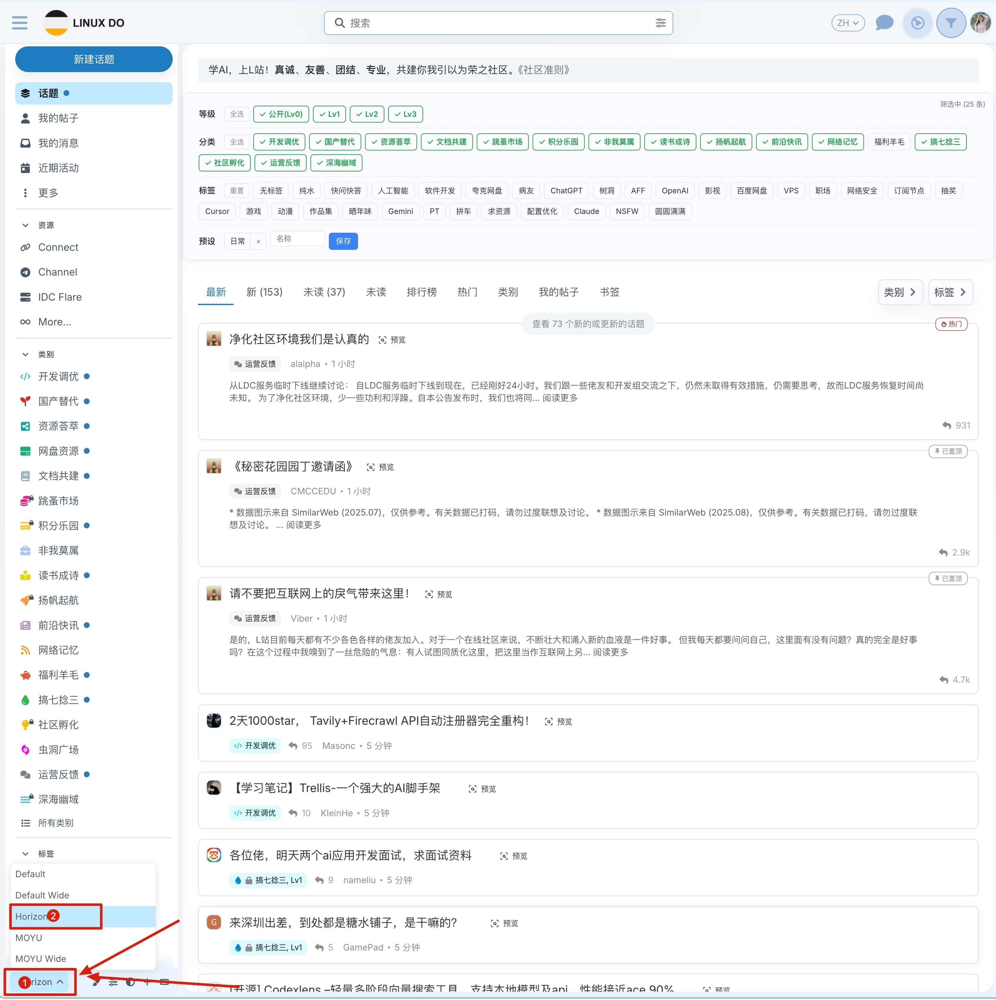
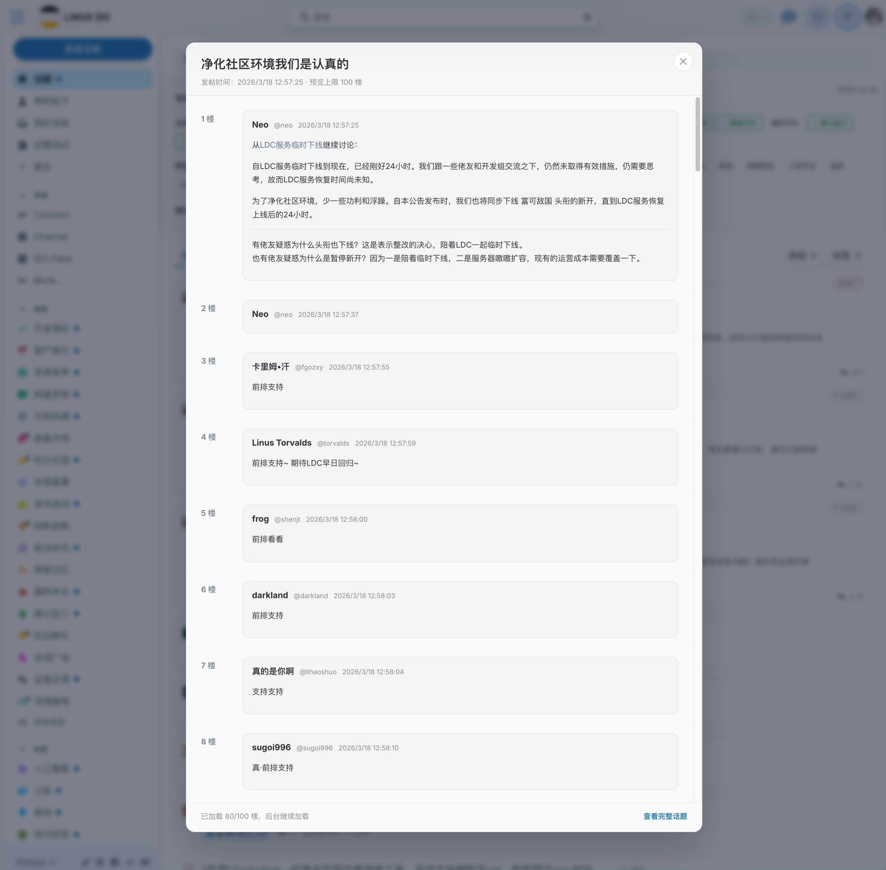

# Linuxdo流光漫游 (Glowdrift)

一个用于 `linux.do` 的 Tampermonkey 浏览增强脚本。  

## 功能特性

- 默认人类自动浏览：按 scan/read/pause 节奏滚动与停顿，减少机械感，模拟更自然的浏览过程。
- 漫游超时自动关闭：单标签页内从启动开始累计运行满 1.5 小时后自动关闭，避免忘记停止。
- 漫游时长大字提醒：页面中间实时显示三行累计时长（历史/今天/本次），均为 `XX:XX:XX` 两位格式。
- 主页筛选工具：在首页按等级、分类、标签筛选帖子，并支持保存/加载筛选预设；筛选结果过少时会自动补载更多帖子。
- 话题预览：点击话题默认弹出预览层，右侧按钮用于在新标签页打开当前话题，预览内可直接点赞。
- 默认切换 Horizon：进入站点时会自动将主题切换到 `Horizon`，作为后续配色注入的基础主题。
- Horizon 浅白灰配色：选中 `Horizon` 主题后，额外提供一套接近白色、仅带轻微灰度的自定义配色。
- 第三方按钮隐藏：自动隐藏其他插件注入的 `免打扰` 按钮（`.donottopic-btn`）。
- 侧边栏滚动条隐藏：左侧侧边栏仍可滚动，但不再显示滚动条。

## 文件结构

- `runscript.js`: 主脚本（Tampermonkey UserScript）

## 文档维护约定

- 脚本顶部注释不再维护详细说明，统一以 `README.md` 为准
- 功能、存储、版本规则等变更只需要更新本 README
- 交流语言统一为中文，提交信息与代码注释也保持中文一致

## 安装方式

1. 安装浏览器扩展 `Violentmonkey`（暴力猴）
2. 新建脚本，并把 [`runscript.js`](./runscript.js) 的全部内容复制进去
3. 保存后打开 `https://linux.do/`
4. 脚本已写入自动更新地址，后续会从以下链接自动检查更新：
   `https://raw.githubusercontent.com/woxiqingxian/LinuxdoGlowdrift/main/runscript.js`
5. 点击顶部新增按钮进行控制：
   - 漫游开关（开始/暂停自动漫游）
   - 筛选开关（启用/停用主页筛选工具）

## 使用说明

- 建议开两个窗口：
  - 窗口 A：开启自动漫游
  - 窗口 B：保持手动浏览
- 因为开关状态使用 `sessionStorage`，每个标签页独立保存，不会互相串联
- 主页筛选工具仅在 `/, /latest, /top, /new` 路径显示
- 页面进入时若当前不是 `Horizon`，脚本会先自动切换到 `Horizon` 再继续后续功能
- 点击话题列表中的话题时，默认进入预览
- 话题右侧按钮用于在新标签页打开当前话题
- `Horizon` 主题下，右侧画笔按钮会打开站点原生配色菜单
- 脚本会在这个原生菜单里追加一个 `Beige` 配色项
- 点击 `Beige` 后启用接近白色、仅带轻微灰度的浅色覆盖
- 点击站点原生其他配色项后，会退出脚本注入的自定义浅白灰覆盖

## 顶部双开关说明

- 漫游开关（播放/暂停图标）：
  - 开启后自动进入漫游流程（滚动 + 链接跳转）
  - 开启后会记录本标签页启动时间，累计运行超过 1.5 小时自动关闭
  - 开启后页面中间显示大字提醒：
    - `历史累计漫游：XX:XX:XX`
    - `今天累计漫游：XX:XX:XX`
    - `本次累计漫游：XX:XX:XX`
  - 关闭后立即停止自动滚动
- 筛选开关（漏斗图标）：
  - 开启后在首页列表上方显示筛选面板
  - 关闭后隐藏筛选面板并恢复全部帖子显示

## 主页筛选工具说明

- 筛选维度：
  - 等级筛选：`公开(Lv0) / Lv1 / Lv2 / Lv3`
  - 分类筛选：按站点分类 ID 和父分类匹配
  - 标签筛选：三态切换（中立 -> 包含 -> 排除）
- 预设能力：
  - 支持按名称保存当前筛选条件
  - 支持点击快速加载预设
  - 支持删除不再需要的预设
- 状态更新：
  - 列表变化后会自动重新筛选
  - 筛选结果少于 12 条时，会优先复用 Discourse 原生入口自动补载更多帖子
  - 连续补载失败 3 次后，会停止继续尝试并提示暂无更多匹配项
  - 右上角状态文本会显示当前筛选结果数量，以及补载中或已熔断状态

## 话题预览说明

- 点击话题列表中的话题时，会直接打开预览层
- 右侧按钮会在新标签页打开当前话题
- 点击后会请求当前主题的 `/t/{id}.json`
- 预览层默认先加载前 `30` 楼，当已加载内容距离底部只剩约 `10` 楼时，会自动补取下一批内容
- 预览层内每一楼都带点赞按钮，已登录时可直接点赞或取消点赞
- 支持点击遮罩关闭，也支持按 `Esc` 关闭

## 存储设计

- `sessionStorage`
  - `linuxdoHelperEnabledInTab`: 当前标签页开关状态
  - `linuxdoHelperStartedAtInTab`: 当前标签页漫游启动时间戳（用于 1.5 小时超时自动关闭）
  - `linuxdoHelperAccountedAtInTab`: 当前标签页上次累计结算时间戳（用于持续累计）
  - `linuxdoSieveEnabledInTab`: 当前标签页筛选开关状态
- `localStorage`
  - `visitedLinks`: 已访问链接列表
- `GM_setValue / GM_getValue`
  - `linuxdoHelperBaseConfig`: 基础参数
  - `linuxdoRoamHistoryMs`: 历史累计漫游时长（毫秒）
  - `linuxdoRoamTodayStat`: 今日累计漫游信息（日期 + 毫秒）
  - `linuxdoSieveLevels`: 筛选等级选中项
  - `linuxdoSieveCats`: 筛选分类选中项
  - `linuxdoSieveTags`: 筛选标签三态状态
  - `linuxdoSievePresets`: 筛选预设
  - `linuxdoHorizonPalette`: Horizon 主题配色状态（`default / beige`）

## 版本规则（强约定）

- 每次修改脚本都必须更新 `@version`
- 版本格式固定：`YYYY.MM.DD.HHmm`（精确到分钟）
- 若同一分钟内有多次修改，至少在下一次提交时刷新到新分钟版本

## 开发建议

- 修改行为节奏优先调整：
  - `SPEED_ENGINE_CONFIG`
  - `HUMAN_BEHAVIOR_CONFIG`
- 修改 UI 体验优先调整：
  - `ensureToggleButtonStyle()`（开始/暂停按钮）
  - `ensureRunningHalo()`（运行光圈）

## License

当前仓库未声明开源许可证。如需开源，建议补充 `LICENSE` 文件。
